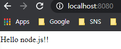
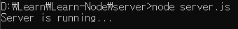

# Node Server
서버 기본 코드 <br>
``` js

var http = require('http'); 

var server = http.createServer(function(request,response){ 

    response.writeHead(200,{'Content-Type':'text/html'});
    response.end('Hello node.js!!');

});

server.listen(8080, function(){ 
    console.log('Server is running...');
}); 

```
server.js 을 실행하고 localhost:8000 에 접속하면 ```Hello node.js!!``` 가 나타나게 된다. <br>
 <br>

이제 코드를 차근차근 알아가보자. <br>
``` js
var http = require('http'); 
```
http 모듈은 받는다. <br>
``` js
var server = http.createServer(function(request,response){ 

    response.writeHead(200,{'Content-Type':'text/html'});
    response.end('Hello node.js!!');

});
```
사용자로 부터 http 요청이 들어오면 function 안에 코드를 실행하게 된다.

``` js
server.listen(8080, function(){ 
    console.log('Server is running...');
});
```
listen 함수를 통해 8080 포트를 사진 서버를 실행한다. <br>
서버가 실행되면 콘솔창에 ```Server is running...``` 이 쓰게될 것이다. <br>
 <br>

